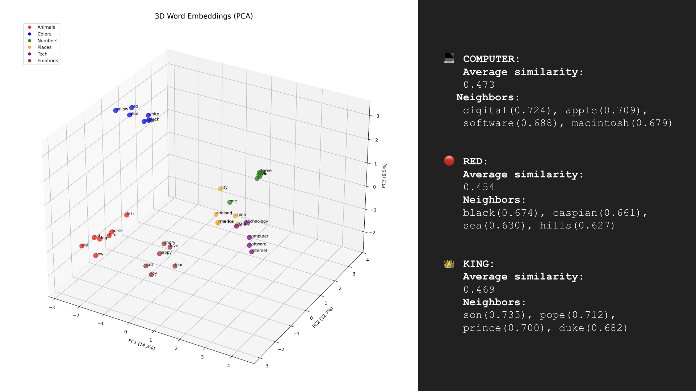

# HackerNews Score Predictor

A machine learning project that predicts HackerNews post scores using title embeddings and feature engineering. The project implements a complete pipeline from data ingestion to deployment using Word2Vec embeddings, feature engineering, and a Dockerized web interface.



[HackerNews Prediction Presentation](https://docs.google.com/presentation/d/19nbAudhtTa2ioSMViiQe1GDkp39ALwXAk3diBRNhKvw/edit?slide=id.p#slide=id.p)

## 🚀 Features

- **Data Pipeline**: Automated extraction of HackerNews data from PostgreSQL database to Parquet format
- **Custom Word2Vec**: From-scratch implementation of Word2Vec using CBOW (Continuous Bag of Words) architecture
- **Feature Engineering**: Advanced feature extraction from HackerNews post metadata
- **ML Model**: Score prediction model using title embeddings and engineered features
- **Web Interface**: Streamlit frontend for interactive predictions and comparisons
- **Containerized**: Full Docker deployment setup

## 📁 Project Structure

```
hackernews-predictor/
├── notebooks/                          # Jupyter notebooks for data analysis and model development
│   ├── store-parquet.ipynb            # Data extraction from PostgreSQL to Parquet
│   ├── model-word2vec.ipynb           # Word2Vec model training from scratch
│   ├── visualize-word2vec.ipynb       # Word2Vec model visualization and analysis
│   └── visualize-feature-engineering.ipynb # Feature engineering and visualization
├── backend/                            # Python ML pipeline
│   ├── main.py                        # FastAPI main application
│   ├── data_processing.py             # Data preprocessing utilities
│   ├── train.py                       # Model training pipeline
│   ├── predict.py                     # Prediction service
│   ├── model.py                       # ML model definitions
│   └── config.py                      # Configuration settings
├── frontend/                           # Streamlit web interface
│   └── streamlit_app.py               # Frontend application
├── data/                              # Data storage
│   ├── hackernews_full_data.parquet   # HackerNews dataset (478MB)
│   ├── embeddings.npy                 # Trained word embeddings
│   ├── word_to_idx.pkl                # Word to index mapping
│   └── glove.6B.200d.txt             # GloVe embeddings for comparison
├── artifacts/                         # Model artifacts and checkpoints
│   └── word2vec_trained_model/        # Trained Word2Vec models
├── Dockerfile                         # Container configuration
└── requirements.txt                   # Python dependencies
```

## 🔧 Technology Stack

- **Languages**: Python 3.10
- **ML Libraries**: PyTorch, scikit-learn, NumPy, Pandas
- **Visualization**: Matplotlib, Streamlit
- **Web Framework**: FastAPI, Uvicorn
- **Database**: PostgreSQL (data source)
- **Containerization**: Docker
- **Experiment Tracking**: Weights & Biases (wandb)
- **Data Format**: Parquet for efficient storage

## 📊 Workflow

### 1. Data Ingestion (`store-parquet.ipynb`)
- Connects to PostgreSQL database containing HackerNews data
- Extracts ~4.9M story records with chunked processing
- Filters for posts with valid scores, titles, and authors
- Stores data in efficient Parquet format for fast access

### 2. Word2Vec Training (`model-word2vec.ipynb`)
- Implements CBOW (Continuous Bag of Words) architecture from scratch
- Trains on HackerNews titles to create domain-specific embeddings
- Uses PyTorch for neural network implementation
- Generates 200-dimensional word embeddings

### 3. Model Visualization (`visualize-word2vec.ipynb`)
- Visualizes trained word embeddings using dimensionality reduction
- Analyzes word relationships and semantic clusters
- Compares model performance across different hyperparameters

### 4. Feature Engineering (`visualize-feature-engineering.ipynb`)
- Creates engineered features from post metadata:
  - Title length and word count
  - Author posting patterns
  - Temporal features (time of day, day of week)
  - Text complexity metrics
- Analyzes feature importance and correlations

### 5. Model Training (`backend/train.py`)
- Combines word embeddings with engineered features
- Trains regression model to predict post scores
- Implements cross-validation and hyperparameter tuning
- Saves trained models and preprocessing pipelines

### 6. Prediction Service (`backend/predict.py`)
- Loads trained models and preprocessing pipelines
- Provides real-time score predictions for new titles
- Handles text preprocessing and feature generation

### 7. Web Interface (`frontend/streamlit_app.py`)
- Interactive Streamlit app for model demonstration
- Allows users to input custom titles for score prediction
- Compares model predictions with human intuition
- Visualizes feature importance and model explanations

## 🐳 Docker Deployment

The project is containerized for easy deployment:

```bash
# Build the Docker image
docker build -t hackernews-predictor .

# Run the container
docker run -p 8888:8888 hackernews-predictor
```

The application will be available at `http://localhost:8888`

## 🛠️ Local Development

### Prerequisites
- Python 3.10+
- PostgreSQL database with HackerNews data (for data ingestion)
- Docker (optional, for containerized development)

### Setup

1. **Clone the repository**
   ```bash
   git clone <repository-url>
   cd hackernews-predictor
   ```

2. **Install dependencies**
   ```bash
   pip install -r requirements.txt
   ```

3. **Environment variables** (for database connection)
   ```bash
   export DB_NAME=your_database_name
   export DB_USER=your_username
   export DB_PASSWORD=your_password
   export DB_HOST=your_host
   export DB_PORT=your_port
   ```

4. **Run Jupyter notebooks** (for development and analysis)
   ```bash
   jupyter notebook
   ```

5. **Run the backend API**
   ```bash
   uvicorn backend.main:app
   ```

6. **Run the Streamlit frontend**
   ```bash
   streamlit run frontend/streamlit_app.py
   ```

## 📈 Model Performance

The model combines:
- **Word2Vec embeddings**: Capture semantic meaning of titles
- **Engineered features**: Metadata patterns that influence post success
- **Regression model**: Predicts numerical scores based on combined features

Key metrics and visualizations are available in the analysis notebooks.

## 🔍 Key Features

### Custom Word2Vec Implementation
- CBOW architecture implemented from scratch in PyTorch
- Domain-specific training on HackerNews titles
- Optimized for technical and startup terminology

### Feature Engineering
- **Temporal features**: Post timing patterns
- **Author features**: Historical posting behavior
- **Text features**: Title complexity and length metrics
- **Domain features**: Technology and startup-specific indicators

### Interactive Predictions
- Real-time score prediction for custom titles
- Feature importance visualization
- Model explanation and interpretability tools

## 📝 Usage Examples

### Predicting Post Scores
```python
from backend.predict import predict_score

title = "New JavaScript Framework Promises Better Performance"
predicted_score = predict_score(title)
print(f"Predicted score: {predicted_score}")
```

### Training Custom Models
```python
from backend.train import train_model

# Train with custom hyperparameters
model = train_model(
    embedding_dim=200,
    hidden_dim=128,
    learning_rate=0.001
)
```

## 🤝 Contributing

1. Fork the repository
2. Create a feature branch (`git checkout -b feature/amazing-feature`)
3. Commit your changes (`git commit -m 'Add amazing feature'`)
4. Push to the branch (`git push origin feature/amazing-feature`)
5. Open a Pull Request

## 📄 License

This project is licensed under the MIT License - see the LICENSE file for details.

---

**Note**: This project is for educational and research purposes. The model predictions should not be used as the sole basis for content strategy decisions. 
